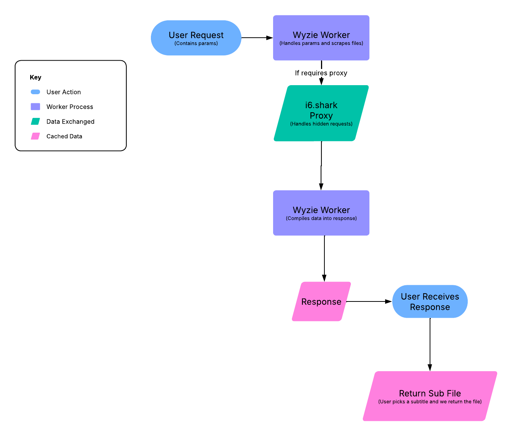

  <a href="https://sub.wyzie.ru/">
    
    <h1 align="center">Wyzie Subs</h1>
  </a>

## A simple easy to use Subtitle Scraper API

### Features
- **Simple**: Just send a request to the API with the TMDB or IMDB ID of the movie or TV show and get the subtitles for.
- **Fast**: The API is hosted on a edge cloud provider with multiple proxies for spoofing requests (response time varies).
- **Free**: The API is completely free to use and has no rate limits (don't abuse this please 🙏).
- **Open-Source**: The API is open-source and you can host it yourself if you want to.

### Currently Supported Providers
1. [OpenSubtitles](https://www.opensubtitles.org/)
2. [SubDl](https://subdl.com/)
3. [Subscene](https://subscene.com/) (Soon)

### Request Flow Chart

### Usage Example

Please note: the `id` url parameter can be used interchangable with either a TMDB ID or an IMDB ID. It checks for "tt" to determine if it's an IMDB ID or not. Using a TMDB ID is slower as we have to request the IMDB ID from TMDB first.

  All parameters work with both TMDB and IMDB IDs, aswell as shows and movies.

